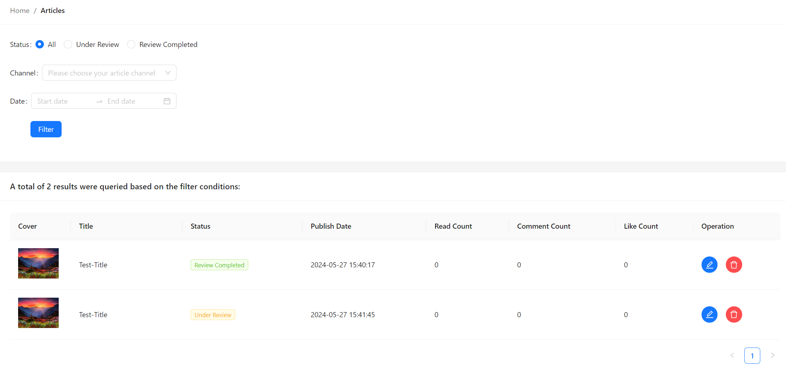

# Getting Started with HeadlineHub
**HeadlineHub** is a client application designed to connect to a local server, allowing users to publish, edit, and manage headline articles.

In the project directory, you can run:

### `npm start`

or 

### `serve -s build`

## Login Page

## Publish/Edit Page

## Article Management

